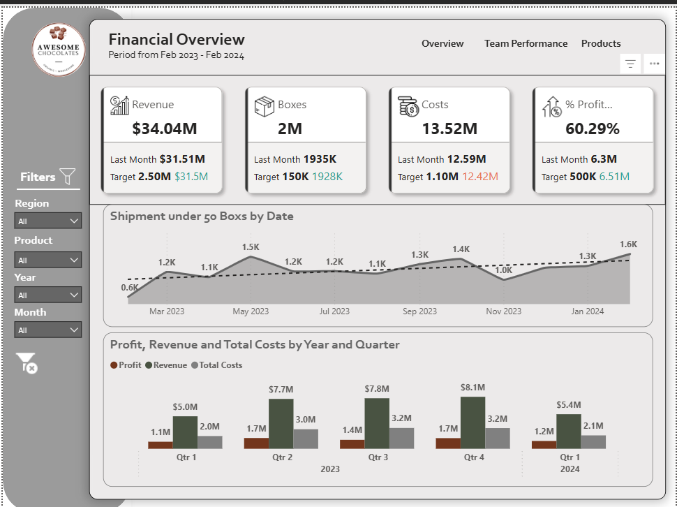
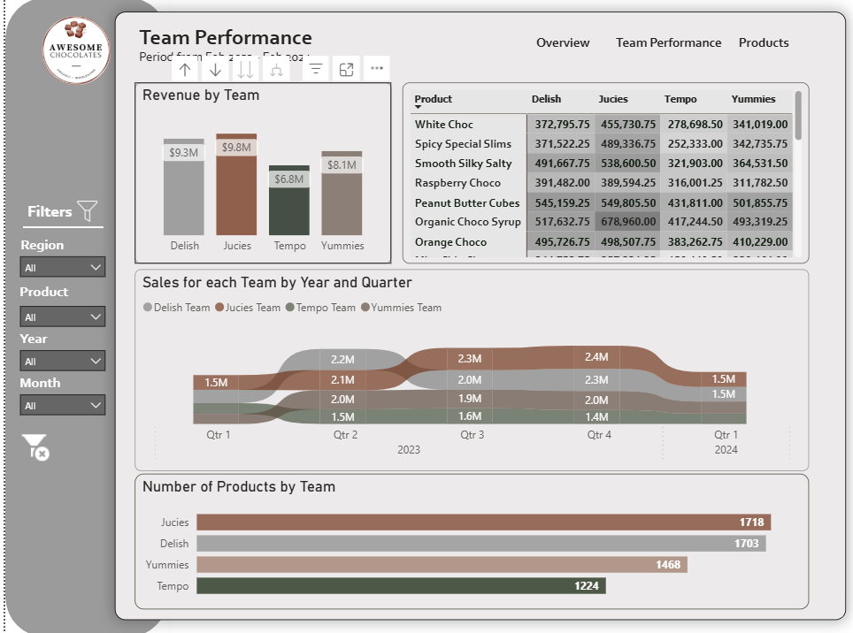
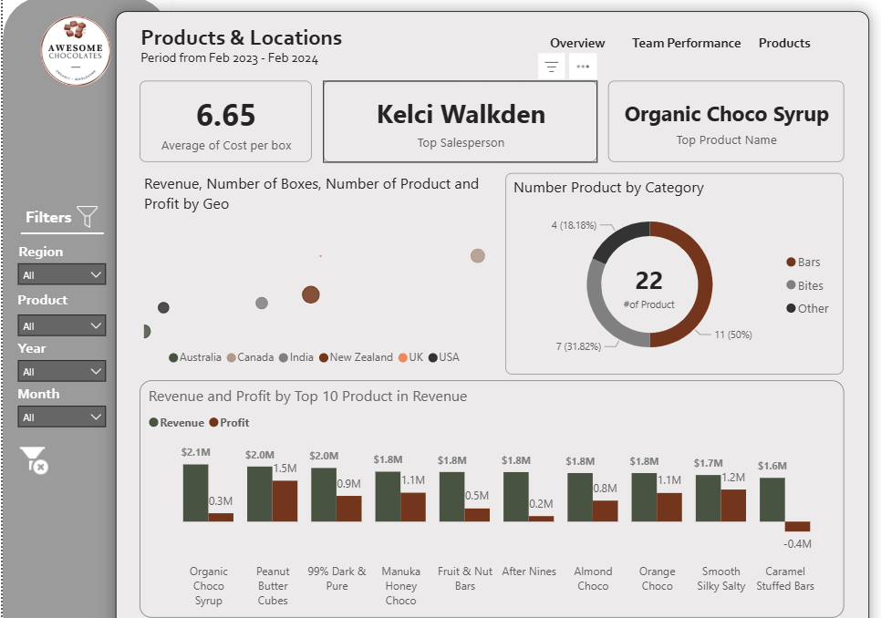

# Awesome Chocolates Sales Dashboard 🍫

A comprehensive Power BI dashboard analyzing chocolate sales performance for Awesome Chocolates from February 2023 to February 2024.

## 📊 Dashboard Overview

This interactive Power BI dashboard provides detailed insights into sales performance, team metrics, and financial analysis across multiple dimensions including geography, products, and time periods.

### Key Performance Indicators
- **Total Revenue**: $34.04M
- **Profit Margin**: 60.29%
- **Total Boxes Sold**: 2 Million
- **Total Costs**: $13.52M
- **Average Cost per Box**: $6.65

## 🏆 Top Performers

- **Best Salesperson**: Kelci Walkden
- **Top Product**: Organic Choco Syrup
- **Leading Team**: Jucies Team ($9.8M revenue)

## 📋 Dashboard Pages

### 1. Financial Overview
- Revenue, costs, and profit tracking
- Monthly shipment trends (600K - 1.6K boxes)
- Quarterly performance analysis
- Target vs actual performance metrics

### 2. Products & Locations
- Geographic performance across 6 markets (Australia, Canada, India, New Zealand, UK, USA)
- Product category breakdown:
  - **Bars**: 50% (11 products)
  - **Bites**: 31.82% (7 products)
  - **Other**: 18.18% (4 products)
- Top 10 products by revenue analysis
- Revenue and profit comparison by product

### 3. Team Performance
- Team revenue comparison:
  - **Jucies**: $9.8M
  - **Delish**: $9.3M
  - **Tempo**: $8.1M
  - **Yummies**: $6.8M
- Product distribution by team
- Quarterly sales trends by team
- Detailed product performance matrix

## 🎯 Key Insights

1. **Strong Profitability**: 60.29% profit margin indicates excellent cost management
2. **Seasonal Trends**: Q4 2023 showed peak performance with $8.1M revenue
3. **Product Mix**: Bars dominate the portfolio, representing half of all products
4. **Team Balance**: Revenue distribution is well-balanced across sales teams
5. **Geographic Reach**: Successfully operating across 6 international markets

## 📁 Repository Contents

- `Chocalate_Sales Dashboard.pbix` - Main Power BI dashboard file
- `screenshots/` - Dashboard page screenshots
- `data/` - Sample data files (if applicable)
- `README.md` - This documentation

## 🚀 Getting Started

### Prerequisites
- Power BI Desktop (latest version)
- Access to data sources (if refreshing data)

### Installation
1. Download the `.pbix` file from this repository
2. Open with Power BI Desktop
3. Refresh data connections if needed
4. Explore the interactive dashboard

## 📈 Features

- **Interactive Filtering**: Filter by region, product, year, and month
- **Drill-through Capabilities**: Navigate between summary and detailed views
- **Real-time Updates**: Dashboard updates with data refresh
- **Mobile Responsive**: Optimized for desktop and mobile viewing
- **Export Options**: Charts and data can be exported for presentations

## 🔧 Technical Details

- **Platform**: Microsoft Power BI
- **Data Period**: February 2023 - February 2024
- **Update Frequency**: Monthly
- **Visualization Types**: KPI cards, bar charts, donut charts, line graphs, data tables

## 📱 Screenshots

### Financial Overview

### Products & Locations  

### Team Performance

### Products & Locations 

>>>>>>> 5e24860103a2d733874a6a96872681b25a5e0b24

## 🤝 Contributing

If you'd like to contribute to this dashboard:
1. Fork the repository
2. Create a feature branch
3. Make your changes
4. Submit a pull request

## 📄 License

This project is licensed under the MIT License - see the LICENSE file for details.

## 📞 Contact

For questions or feedback about this dashboard, please reach out through GitHub issues.

---

**Built with ❤️ using Microsoft Power BI**
